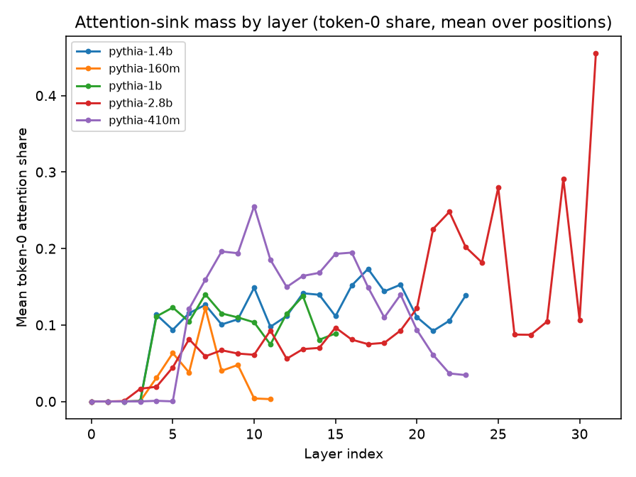

# Mixing Matters: Position Bias Across Sequence Mixers

Official repository for **Mixing Matters**, an empirical study of how attention and state-space language models use evidence at different positions in long contexts.

We move the answer-bearing document through ten positions while keeping the question and nine distractors fixed.
This controlled setup reveals that evidence position is not only a property of the task or prompt: it changes systematically with the model's sequence mixer.

## Key Results

  
  

**Figure 1:** Pythia-2.8B is about **5.2 percentage points more accurate** when evidence appears near the beginning rather than the middle, while similarly sized Mamba and Mamba-2 models show no beginning advantage.
In the tighter 8B comparison, the hybrid with 7% attention layers shows a larger beginning advantage than pure Mamba-2, but the difference remains statistically uncertain.

  
  

**Figure 2:** The Pythia-Mamba gap is near zero at the smallest scales and grows to roughly **5.3-6.9 points** in larger model pairs.
Late-layer attention-sink mass tracks the same trend, while probes show that Mamba retains position information even without the beginning advantage.
These mechanism results are correlational and do not establish that attention is the cause.

Additional controls show that changing the training corpus does not reshape the curve, synthetic retrieval reproduces the Pythia pattern, and repeating the question before and after the documents can raise Mamba's beginning advantage by **10.3 points**.

## Paper and Artifacts

- [Paper PDF](paper/mixing-matters-newinml-2026.pdf)
- [Experiment source of truth](paper/EXPERIMENT-SOURCE-OF-TRUTH.md)
- [Per-phase artifacts](artifacts/)

All reported results are exploratory.
The held-out confirmatory split remains unexamined.
