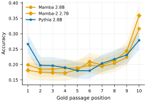
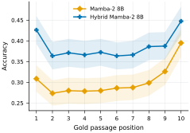
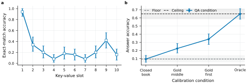
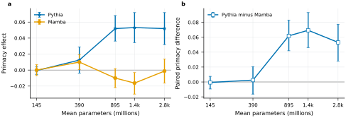
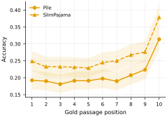
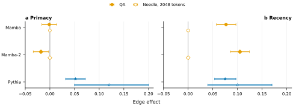
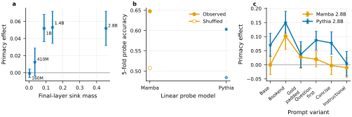
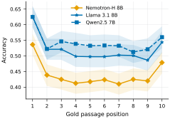

# Mixing Matters?

## Evidence and Its Limits for Position Bias Across Sequence Mixers

This repository studies whether language models use the same evidence differently when only its position in a long context changes.
It compares Transformer, state-space, and hybrid sequence mixers with a paired, ten-position intervention derived from the [Lost in the Middle](https://aclanthology.org/2024.tacl-1.9/) evaluation.

[**Project page**](https://beingamanforever.github.io/Mixing-Matters/) | [**Paper**](paper/mixing-matters-newinml-2026.pdf) | [**Dataset**](dataset/) | [**Evidence ledger**](paper/EXPERIMENT-SOURCE-OF-TRUTH.md) | [**Artifacts**](artifacts/) | [**Runbooks**](docs/) | [**Code**](src/mixing_matters/) | [**License**](LICENSE)

## Study design

The released evaluation contains 2,655 multi-document questions, each with one answer-bearing passage and nine fixed distractors.
We use 800 questions for exploratory analysis and leave 1,855 questions untouched for confirmation.
For each question, we move the answer-bearing passage through positions 1 to 10 while holding the question, distractors, prompt template, and decoding configuration fixed.

Primacy is mean accuracy at positions 1 and 2 minus mean accuracy at positions 5 and 6.
Recency is mean accuracy at positions 9 and 10 minus mean accuracy at positions 5 and 6.
Inference uses 10,000 bootstrap resamples of complete question bundles and Holm correction across the two edge tests.

## Main results

<p align="center">
  
  
</p>

**Primary comparison.**
Pythia-2.8B has a `+5.19` percentage-point primacy edge, while Mamba-2.8B and Mamba-2 2.7B have edges of `-0.13` and `-1.81` points.
The paired Pythia-minus-Mamba primacy differences are `+5.31` and `+7.00` points, both with Holm `p < 0.0001`.
All three models show positive recency edges.
See the [Phase 2 summary](artifacts/phase2/report/phase2-summary.json).

**Matched 8B comparison.**
The hybrid model has a larger primacy estimate than pure Mamba-2, but the paired hybrid-minus-pure effect is `+1.88` points with a 95% confidence interval of `[-0.56, +4.44]` and Holm `p = 0.1442`.
The direction is consistent with the primary comparison, but the paired effect is statistically uncertain and does not establish that attention caused the difference.
This released-checkpoint contrast also changes the models' MLP composition, so it is not an attention-only intervention.
The original run recorded a dirty producing tree, while a later clean rerun at commit `33d6bb5` reproduced the summary byte-for-byte.
See the [Phase 3 summary](artifacts/phase3/report/phase3-summary.json), [clean-rerun report](artifacts/phase3/rerun-33d6bb5/REPORT.md), and the matched model release of [Waleffe et al. (2024)](https://arxiv.org/abs/2406.07887).

## Controls and scope

<p align="center">
  
  
</p>

**Calibration and scale.**
The end-to-end calibration and key-value control show that the harness can detect a known position effect.
Across five approximate size pairs, the family gap is near zero at the two smallest scales and appears in the three larger pairs, but capability and architecture remain confounded.
See the [Phase 1 summary](artifacts/phase1/summary.json), [Phase 4 summary](artifacts/phase4/report/phase4-summary.json), and the original [Pythia](https://proceedings.mlr.press/v202/biderman23a.html), [Mamba](https://openreview.net/forum?id=tEYskw1VY2), and [Mamba-2](https://proceedings.mlr.press/v235/dao24a.html) papers.

<p align="center">
  
  
</p>

**Corpus and task checks.**
Changing the Mamba-2.8B pretraining corpus changes overall accuracy but produces no detectable primacy or recency shape change in this executed contrast.
On [RULER](https://openreview.net/forum?id=kIoBbc76Sy) at 2K tokens, Pythia reproduces a primacy edge, while both Mamba models saturate at perfect accuracy and therefore do not support a mixer comparison on that task.
See the [Phase 5 summary](artifacts/phase5/report/phase5-summary.json) and [Phase 6 summary](artifacts/phase6/report/phase6-summary.json).

<p align="center">
  
</p>

**Mechanistic evidence.**
Late-layer [attention-sink](https://openreview.net/forum?id=NG7sS51zVF) mass tracks Pythia primacy across scale, position remains linearly decodable in both model families, and prompt variants show substantially different per-condition edges.
These results are correlational and diagnostic, not evidence of a causal mechanism.
See the [Phase 7 summary](artifacts/phase7-mechanisms/report/phase7-summary.json).

<p align="center">
  
</p>

**Production systems.**
Nemotron-H-8B, Llama-3.1-8B, and Qwen2.5-7B all show positive primacy edges, but their many architectural and training differences make this a descriptive prevalence check rather than an architecture test.
See the [Phase 8 summary](artifacts/phase8/report/phase8-summary.json).

## Reproduction

The committed summaries regenerate every canonical SVG and PDF figure deterministically.

```bash
uv sync --extra test
uv run pytest -q
uv run python paper/generate_figures.py
```

GPU execution, checkpoint validation, and phase-specific analysis commands are documented in the [runbooks](docs/).
The [figure tests](tests/test_paper_figures.py) check deterministic regeneration, expected labels, and source-summary provenance.

## Released dataset

The released dataset flattens 229,700 selected committed model generations across 17 pinned checkpoints, 10 evidence positions, 4 prompt variants, and 2 tasks into one schema in [`dataset/`](dataset/), together with 280,000 per-layer attention-sink measurements.
It excludes the uncommitted Phase 6 synthetic-retrieval generations, the later Pythia certification-control runs, and the duplicate clean Phase 3 rerun.
Field documentation and collection details are in the [datasheet](dataset/DATASHEET.md).

```bash
uv run mixing-matters build-dataset --output dataset
```

The builder reads only committed artifacts, so any clone reproduces the same files.

## Project page

The [project page](https://beingamanforever.github.io/Mixing-Matters/) presents these results interactively.
Its source is in [`web/`](web/), and every number it renders is generated from the committed phase summaries.

```bash
uv run mixing-matters build-site-data --output web/data/results.json
python3 -m http.server 8123 --directory web
```

Pushing to `main` deploys it through [the Pages workflow](.github/workflows/pages.yml), which regenerates the page data and stages the paper PDF and the dataset alongside it.

## Evidence boundary

- All reported ten-document QA results are exploratory, and the 1,855-question confirmatory split remains unopened.
- The committed sham-gold and distractor-order controls passed on a 200-question exploratory Pythia sample, but they were not run on the 8B Megatron checkpoints, and the prepared manual audit has no human labels.
- The matched 8B paired effect is statistically uncertain, and the mechanism analyses do not support a causal attention claim.
- Confidence intervals quantify variation across questions for fixed checkpoints, prompts, and decoding settings, not variation across training seeds or model checkpoints.

## References and citation

The paper builds on the position-intervention protocol of [Liu et al. (2024)](https://aclanthology.org/2024.tacl-1.9/) and evaluates models introduced by [Biderman et al. (2023)](https://proceedings.mlr.press/v202/biderman23a.html), [Gu and Dao (2024)](https://openreview.net/forum?id=tEYskw1VY2), [Dao and Gu (2024)](https://proceedings.mlr.press/v235/dao24a.html), and [Waleffe et al. (2024)](https://arxiv.org/abs/2406.07887).
The complete scholarly bibliography is included in the [paper](paper/mixing-matters-newinml-2026.pdf).

The public author list and archival paper URL are not yet available.
Until they are released, please cite the paper by title: *Mixing Matters? Evidence and Its Limits for Position Bias Across Sequence Mixers*, New in ML workshop submission, 2026.
Archival BibTeX will be added after the public author list and paper URL are available.

## Acknowledgments

We thank the Indian Institute of Technology Roorkee (IIT Roorkee) for providing the computational resources that supported this research.

## License

This project is released under the [Apache License 2.0](LICENSE).
