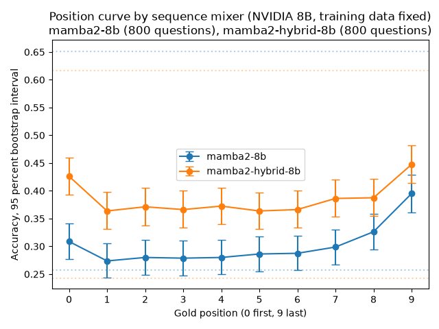
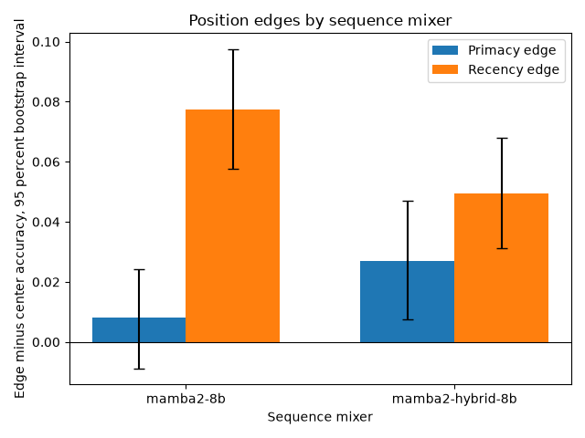
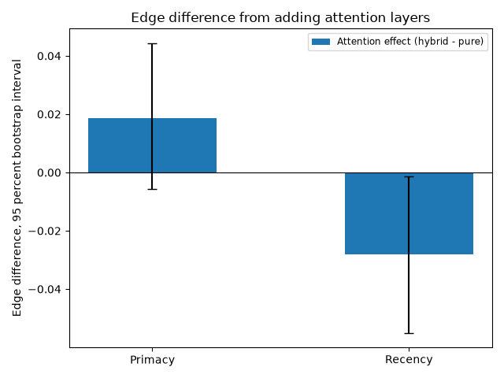

# Phase 3: architecture control (pure versus hybrid Mamba-2)

## Question

Does adding attention layers to an otherwise matched Mamba-2 model change the position-accuracy curve?

Phase 3 holds the training data, tokenizer, parameter count, depth, and positional-encoding setup fixed and changes only whether attention layers are present, then asks whether that alone moves the accuracy-versus-evidence-position curve.

## Setup

Two 8B-parameter NVIDIA models trained on the same 3.5T-token corpus with the same 256k SentencePiece tokenizer, the same 56-layer depth, and no positional encoding.

| Model | Attention layers | Source |
|---|---|---|
| `mamba2-8b` | none (pure Mamba-2) | `nvidia/mamba2-8b-3t-4k` |
| `mamba2-hybrid-8b` | ~7% of layers | `nvidia/mamba2-hybrid-8b-3t-4k` |

Both checkpoints are published only as Megatron-LM distributed checkpoints, so both run through the same NVIDIA Megatron-LM `MambaModel` backend rather than transformers, on one shared CUDA-kernel execution path (see `docs/phase3-runbook.md`). Each model was gated on its own published zero-shot benchmark (Waleffe et al. 2024, arXiv:2406.07887) before its sweep: PIQA 79.82 for the pure model (Table 3) and 79.65 for the hybrid (Table 7), both +/- 1.0 point.

| Model | PIQA (this run) | Published target | Delta |
|---|---|---|---|
| `mamba2-8b` | 79.27 | 79.82 | -0.55 |
| `mamba2-hybrid-8b` | 79.65 | 79.65 | +0.00 |

Each model ran the ten-position sweep over 800 exploratory questions plus the closed-book floor and oracle ceiling, 9,600 generations per model, with zero excluded questions and zero scoring failures.

## Result: attention layers do not detectably move either edge

Edges are defined as in Phase 2: primacy is mean accuracy at positions 0,1 minus positions 4,5, and recency is mean accuracy at positions 8,9 minus positions 4,5, with a paired bootstrap over the 800 shared question bundles (10,000 resamples) and Holm correction across the two edges. The contrast is hybrid minus pure, so a positive estimate means adding attention widened that edge.

| Contrast | Primacy | Recency |
|---|---|---|
| Pure edge | +0.81pp, 95% CI [-0.87, +2.44] | +7.75pp, 95% CI [+5.75, +9.75], p < 1e-4 |
| Hybrid edge | +2.69pp, 95% CI [+0.75, +4.69], p = 0.007 | +4.94pp, 95% CI [+3.13, +6.81], p < 1e-4 |
| Attention effect (hybrid - pure) | +1.88pp, 95% CI [-0.56, +4.44], Holm p = 0.144 | -2.81pp, 95% CI [-5.50, -0.12], Holm p = 0.089 |

Both models show a large, highly significant recency effect: whichever the sequence mixer, accuracy is highest when the gold document sits at the very end of the prompt. Neither model shows a significant primacy effect on its own paired edge test in the pure model (the interval spans zero); the hybrid's own primacy edge is nominally significant (p = 0.007), but the paired hybrid-minus-pure contrast on the same question bundles is not (Holm p = 0.144) - the two individual per-model tests disagreeing on significance is not itself evidence of a difference, which is exactly what the paired contrast is designed to check instead of eyeballing.

The recency contrast is the closer call: hybrid minus pure is -2.81 percentage points, and its 95% interval excludes zero at the raw significance level (p = 0.045) but not after Holm correction across the two edges (p = 0.089). That is suggestive that the hybrid's recency edge may be smaller than the pure model's, not evidence that it is.

## Floor and ceiling

| Model | Closed-book floor | Oracle ceiling |
|---|---|---|
| `mamba2-8b` | 25.75% | 65.13% |
| `mamba2-hybrid-8b` | 24.25% | 61.63% |

The hybrid's oracle ceiling is about 3.5 points lower than the pure model's when the gold document is the only document present, a difference this report does not test statistically since it falls outside the primacy/recency edge contrast. Both floors are similar, so neither model is leaning more heavily on memorized knowledge than the other in the closed-book condition.

## What Phase 3 can and cannot claim

Phase 3 changes only the presence of attention layers, with the training data, tokenizer, parameter count, depth, and positional encoding all fixed, so a curve difference would be attributable to the attention layers. The result here is a null one at this sample size: neither edge shows a Holm-significant attention effect, though the recency edge is close enough (raw p = 0.045) to be worth revisiting with the confirmatory question set rather than treated as settled.

Because both Phase 3 models run on the Megatron path rather than the transformers path the Phase 2 and Phase 5 Mamba models use, the Phase 3 contrast is read on its own here and is not placed beside another phase's contrast.
