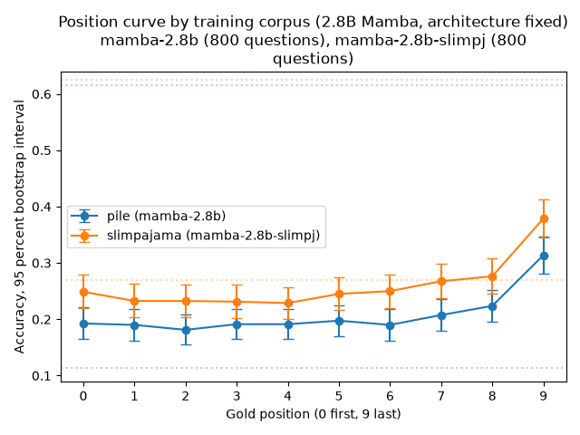
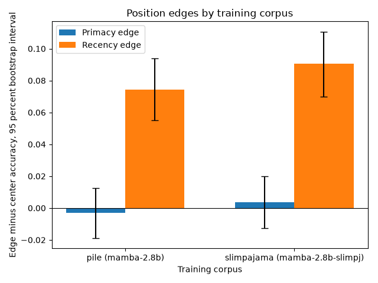

# Phase 5: training-data control

## Question

Can training data change position bias without changing the architecture?

Phase 5 holds the Mamba architecture fixed and changes only the pretraining corpus, from the Pile to SlimPajama, and asks whether that alone moves the accuracy-versus-evidence-position curve.

## Setup

Two checkpoints of the same 2.8B Mamba architecture, 64 layers, no positional encoding, identical GPT-NeoX-20B tokenizer, run through the identical transformers CUDA-kernel path on the same A10G host.

| Model | Corpus | Source | Revision |
|---|---|---|---|
| `mamba-2.8b` | the Pile | `state-spaces/mamba-2.8b-hf` | `96c48e0292b63f5346b6d30061af2551f7101e26` |
| `mamba-2.8b-slimpj` | SlimPajama | `state-spaces/mamba-2.8b-slimpj` | `a7bdd41af90ca0cc4ecfbd967e2ec28f1954b915` |

The only thing that differs between the two runs is the training corpus.
Both were run in the same batch with the same code, greedy decoding, temperature 0, 32 new tokens, seed 240521, bf16, on the same GPU.
This is a stronger contrast than reusing the Phase 2 `mamba-2.8b` sweep, which was produced on an A40; that run is kept only as a reproducibility reference.

The SlimPajama checkpoint is published only in the original state-spaces format, which transformers cannot load.
It was converted once to an HF `MambaForCausalLM` directory (see `docs/phase5-runbook.md` and `conversion-manifest.json`) so that both arms load through the same execution path and the execution path is not a second changing variable.
The conversion was checked against the original weights run through the authors' own `mamba_ssm` implementation: top-1 next-token agreement on 5 of 5 audited prompts, maximum absolute logit differences of 0.25 to 0.63 against a logit scale of 41 to 47, and 2 of 5 byte-identical 32-token greedy generations, the rest drifting only after several tokens.
Those differences are the expected bfloat16 contraction-order noise between the two kernel paths and are in line with the Phase 2 Mamba-2 conversion check.

Each model ran the ten-position sweep over 800 exploratory questions plus the closed-book floor and oracle ceiling, 9,600 generations per model, with zero scoring failures.

## Result: the corpus did not change the curve shape

The two position curves have the same shape.
Both corpora produce a flat primacy region and a strong recency rise toward the last position, and swapping the corpus leaves both edges statistically unchanged.

Edges are defined as in Phase 2: primacy is mean accuracy at positions 0,1 minus positions 4,5, and recency is mean accuracy at positions 8,9 minus positions 4,5, with a paired bootstrap over the 800 question bundles (10,000 resamples) and Holm correction across the two edges.

| Contrast | Primacy | Recency |
|---|---|---|
| Pile edge | -0.003, 95% CI [-0.019, +0.013] | +0.074, 95% CI [+0.055, +0.094], p < 1e-4 |
| SlimPajama edge | +0.004, 95% CI [-0.013, +0.020] | +0.091, 95% CI [+0.070, +0.111], p < 1e-4 |
| Corpus effect (Pile - SlimPajama) | -0.007, 95% CI [-0.030, +0.016], Holm p = 0.57 | -0.016, 95% CI [-0.044, +0.012], Holm p = 0.50 |

Both corpora show essentially no primacy edge and a large, highly significant recency edge.
The corpus effect on each edge is small and its interval spans zero, so within this comparison the training data did not detectably move either arm of the curve.

SlimPajama does raise the whole curve: accuracy is about 0.05 higher at every position, and the closed-book floor rises from 0.11 to 0.27 while the oracle ceiling is essentially unchanged (0.62 to 0.63).
So SlimPajama carries more of this benchmark's answers as memorized knowledge, but that lift is uniform across positions and does not reshape the curve.

## Comparison with the other phases

Phase 2 found that changing the sequence-mixing architecture, Pythia versus Mamba on the Pile, moved the primacy edge by +0.053 (95% CI [+0.028, +0.078], Holm p < 1e-4) with no recency change.
Phase 5 finds that changing the corpus on a fixed Mamba moved neither edge.

The architecture primacy effect has an interval that excludes zero; the corpus primacy effect has an interval that includes it.
The descriptive magnitude label in `phase5-summary.json` reads "comparable" for both edges, but that is the conservative reading of two effects estimated on different question universes whose bootstrap intervals nearly touch; it is not a paired test.
The load-bearing statement is the one the p-values support: the architecture moved the primacy edge and the corpus did not.

This is also consistent with Phase 4, where the primacy gap was a Pythia-versus-Mamba (architecture) phenomenon across scale.
Read together, within these models the shape of the position curve tracks the architecture, not which of these two corpora trained it.

## Controls and honesty checks

- Both Mamba models fail the key-value retrieval positive control (Pile 0.000, SlimPajama 0.006 over 500 records).
  This is non-gating and matches Phase 2: it is a finding about base Mamba's retrieval, and Phase 1 already established that the pipeline detects a real position effect.
- Prompt length is held constant across positions: the gold prompt token span is 0 or 1 for every question, within the 2-token allowance for byte-pair merges at document boundaries.
- Floor and ceiling are recorded per question and attached to every gold record.

## Reproducibility

- Host: A10G, driver 570.133.20, CUDA 12.6.
- torch 2.7.1+cu126, transformers 4.57.1, mamba-ssm 2.2.6.post3, causal-conv1d 1.5.3.post1, Mamba CUDA kernels compiled for the host compute capability.
- Both models report `cuda_kernels` as their execution path; the runner refuses to fall back to the reference path.
- Converted SlimPajama weights, bf16 safetensors: `365b445082b123c880c90680a0dd0eae3cc703409de198a391b6aa7d32fa41eb` and `92c4c46281c02dfb0acc4a9a9d9fa9bbf45e76099faf3c56e0e7740810b57f0c`.
- Raw generations and environments are preserved under `mamba-2.8b/` and `mamba-2.8b-slimpj/`; the machine-readable statistics are in `report/phase5-summary.json`.

## What Phase 5 can and cannot claim

The corpus changed with the architecture, tokenizer, parameter count, and depth all fixed, so the null result is attributable to the training data rather than to any of those.
The result is a null: within this architecture and at 800 questions, with edge intervals about 0.03 wide, an edge shift larger than roughly 0.03 to 0.04 would have been detected, and none was.
It does not isolate any single property of SlimPajama versus the Pile, only that swapping these two corpora did not reshape the position curve.
